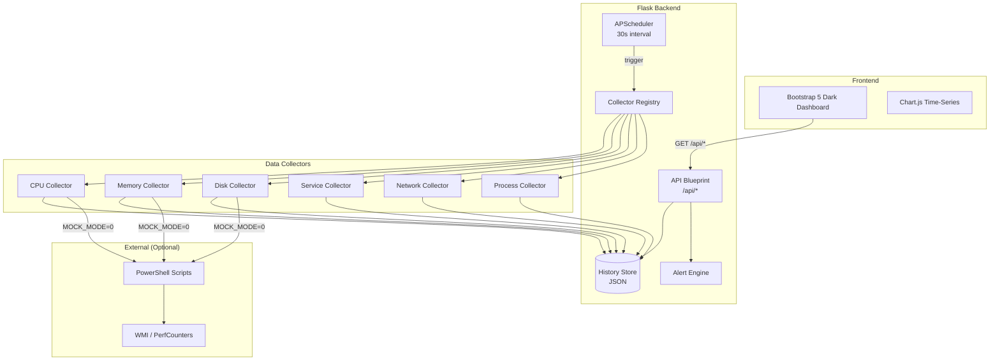

# win-srv-monitor

> 🇨🇳 **中文简介**：Windows Server 监控仪表盘——基于 Flask + Bootstrap 5 暗色主题 + Chart.js 构建的轻量级企业 IT 运维监控工具。支持 CPU / 内存 / 磁盘 / Windows 服务状态 / 进程排行 / 网络流量的实时采集与展示，内置模拟数据模式，无需真实 Windows 服务器即可体验完整功能。

---

[](https://www.python.org/)
[](LICENSE)
[](https://flask.palletsprojects.com/)

## ✨ Features

- **Real-time Dashboard** — Dark-themed single-page UI with 6 KPI cards, 3 time-series charts, and 3 data tables
- **Collector Registry** — Decorator-based `@register_collector("cpu")` pattern; add new collectors in 10 lines
- **Multi-Server Support** — Monitor multiple Windows servers from a single pane of glass
- **Mock Data Mode** — Set `MOCK_MODE=1` to run without real Windows servers (perfect for demos)
- **Alert Engine** — Configurable thresholds for CPU, memory, disk, and Windows service status
- **RESTful API** — Clean JSON endpoints for integration with other tools
- **PowerShell Collectors** — Production-ready `.ps1` scripts for WMI / Performance Counter data collection
- **Scheduler** — APScheduler-based periodic collection every 30 seconds

## 🏗️ Architecture



## 📁 Project Structure

```
win-srv-monitor/
├── monitor/                    # Main application package
│   ├── __init__.py             #   Package init + version
│   ├── __main__.py             #   CLI entry point
│   ├── app.py                  #   Flask app factory
│   ├── config.py               #   Configuration management
│   ├── models.py               #   Pydantic data models
│   ├── store.py                #   In-memory + JSON history store
│   ├── api/                    #   Flask Blueprint (REST API)
│   │   ├── __init__.py
│   │   └── routes.py           #   All API route handlers
│   ├── collectors/             #   Data collector modules
│   │   ├── __init__.py         #   Registry + base class
│   │   ├── cpu.py              #   CPU usage collector
│   │   ├── memory.py           #   Memory usage collector
│   │   ├── disk.py             #   Disk usage collector
│   │   ├── service.py          #   Windows service collector
│   │   ├── network.py          #   Network stats collector
│   │   └── process.py          #   Process ranking collector
│   ├── scheduler/              #   APScheduler integration
│   │   ├── __init__.py
│   │   └── jobs.py             #   Scheduled job definitions
│   ├── templates/
│   │   └── dashboard.html      #   Main dashboard template
│   └── static/
│       ├── css/dashboard.css   #   Custom dark-theme styles
│       └── js/dashboard.js     #   Chart.js + polling logic
├── collectors/                 # PowerShell collection scripts
│   ├── get_cpu_usage.ps1
│   ├── get_disk_usage.ps1
│   ├── get_service_status.ps1
│   └── get_network_stats.ps1
├── samples/                    # Example data files
│   ├── ws_prod_01_sample.json
│   ├── ws_db_02_sample.json
│   ├── ws_web_03_sample.json
│   └── sample_alerts.json
├── tests/                      # pytest test suite
│   ├── conftest.py
│   ├── test_api.py
│   ├── test_registry.py
│   ├── test_scheduler.py
│   ├── test_collectors.py
│   ├── test_models.py
│   ├── test_store.py
│   └── test_integration.py
├── data/                       # Runtime data (gitignored)
├── .github/workflows/ci.yml
├── pyproject.toml
├── requirements.txt
├── requirements-dev.txt
├── LICENSE
└── README.md
```

## 🚀 Quick Start

### Prerequisites

- Python 3.10+
- pip

### Installation

```bash
# Clone the repository
git clone https://github.com/yourusername/win-srv-monitor.git
cd win-srv-monitor

# Create virtual environment
python -m venv .venv
source .venv/bin/activate  # Linux/macOS
# .venv\Scripts\activate   # Windows

# Install dependencies
pip install -r requirements.txt
```

### Run with Mock Data (Demo Mode)

```bash
# No Windows server required!
MOCK_MODE=1 python -m monitor
```

Open your browser to **http://localhost:5000** and see the dashboard.

### Run with Real Windows Servers

1. Copy PowerShell scripts from `collectors/` to your Windows servers
2. Configure server list in `.env` or environment variables
3. Run without `MOCK_MODE`:

```bash
python -m monitor
```

## 📡 API Documentation

| Method | Endpoint | Description |
|--------|----------|-------------|
| GET | `/` | Dashboard UI |
| GET | `/api/overview` | Aggregated KPI summary |
| GET | `/api/servers` | List all monitored servers |
| GET | `/api/servers/<id>/cpu` | CPU metrics for a server |
| GET | `/api/servers/<id>/memory` | Memory metrics for a server |
| GET | `/api/servers/<id>/disk` | Disk metrics for a server |
| GET | `/api/servers/<id>/services` | Windows service status |
| GET | `/api/servers/<id>/processes` | Top processes by CPU |
| GET | `/api/servers/<id>/network` | Network interface stats |
| GET | `/api/alerts` | Alert history |
| POST | `/api/alerts/threshold` | Update alert thresholds |

### Example: GET /api/overview

```json
{
  "timestamp": "2026-09-07T21:00:00",
  "servers_total": 3,
  "servers_online": 3,
  "cpu_avg": 45.2,
  "memory_avg": 68.5,
  "disk_alerts": 1,
  "services_down": 0,
  "recent_alerts": 2
}
```

### Example: POST /api/alerts/threshold

```json
{
  "cpu": 80,
  "memory": 85,
  "disk": 90
}
```

## 🔧 Configuration

| Variable | Default | Description |
|----------|---------|-------------|
| `MOCK_MODE` | `1` | Enable mock data (set `0` for real collection) |
| `FLASK_HOST` | `0.0.0.0` | Flask bind address |
| `FLASK_PORT` | `5000` | Flask port |
| `COLLECT_INTERVAL` | `30` | Collection interval in seconds |
| `SERVERS` | _(built-in)_ | JSON list of server configs |
| `DATA_DIR` | `data` | History data directory |

Create a `.env` file to override defaults:

```bash
MOCK_MODE=1
FLASK_PORT=8080
COLLECT_INTERVAL=15
```

## 🧪 Testing

```bash
# Install dev dependencies
pip install -r requirements-dev.txt

# Run tests with coverage
pytest --cov=monitor --cov-report=term-missing

# Run specific test module
pytest tests/test_api.py -v
```

## 📊 Dashboard Preview


> _The dark-themed dashboard features 6 KPI cards at the top, 3 real-time charts in the middle, and 3 data tables at the bottom._

## 🤝 Contributing

1. Fork the repository
2. Create a feature branch (`git checkout -b feature/amazing-collector`)
3. Add your collector using the registry pattern:

```python
from monitor.collectors import register_collector, BaseCollector

@register_collector("gpu")
class GPUCollector(BaseCollector):
    def collect(self, server):
        return {"gpu_usage": 42, "gpu_temp": 65}
```

4. Write tests and open a PR!

## 📄 License

MIT (c) 2026 Yin Jing. See [LICENSE](LICENSE) for details.
